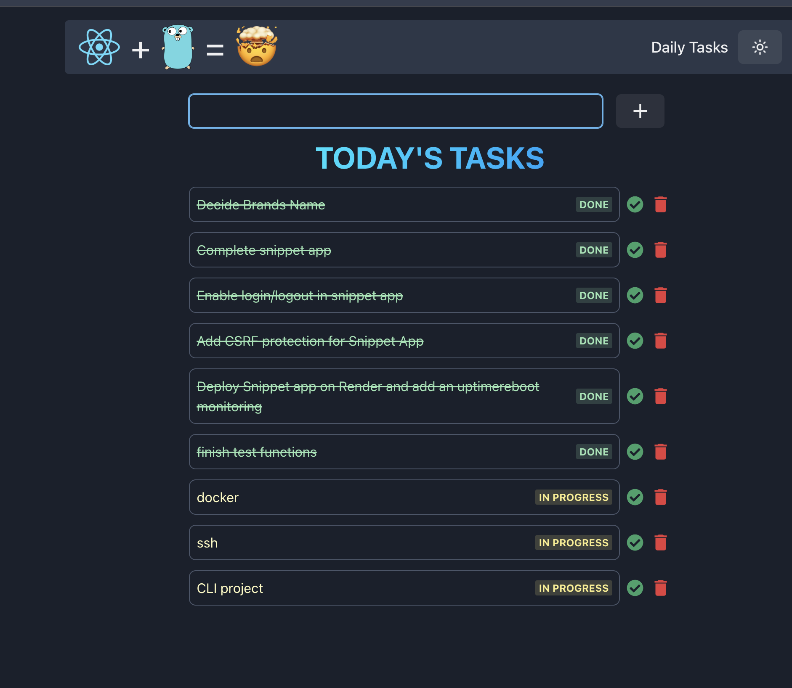

# Task Manager ✅

A full-stack **task management app** built with **Go (backend)** and **React + Vite + TypeScript (frontend)**.  
The backend uses **MongoDB** for data persistence, and the project is deployed on **Render**.

---

## 🚀 Features
- Add, update, and delete tasks  
- Mark tasks as **Done** or **In Progress**  
- Persistent storage with **MongoDB**  
- REST API built with Go  
- Modern frontend with **React + Vite + TypeScript**  
- Deployed on Render for easy access  

---

## 🌐 Live Demo
👉 [Task Manager App](https://task-app-go.onrender.com/)

---

## 📂 Project Structure
```
.
├── main.go             # Go entry point (server + APIs)
├── client/             # React frontend
│   ├── src/            # Frontend source code
│   ├── public/         # Static assets
│   ├── package.json
│   └── vite.config.ts
├── go.mod
├── go.sum
└── README.md
```

---

## ⚡ Getting Started

### 1. Clone the repository
```bash
git clone https://github.com/<your-username>/task-app-go.git
cd task-app-go
```

### 2. Backend Setup (Go)
- Install dependencies:
```bash
go mod tidy
```

- Set up environment variables for MongoDB:
```env
MONGO_URI=mongodb+srv://<username>:<password>@<cluster-url>/taskdb
PORT=8080
```

- Run the server:
```bash
go run main.go
```

The backend will run on **http://localhost:8080**

---

### 3. Frontend Setup (React + Vite + TypeScript)
```bash
cd client
npm install
npm run dev
```

The frontend will run on **http://localhost:5173**

---

## 🛠 Tech Stack
- **Backend**: Go, net/http  
- **Frontend**: React, Vite, TypeScript  
- **Database**: MongoDB  
- **Deployment**: Render (backend + frontend)  

---

## 📖 API Endpoints

### Tasks
- `GET /api/tasks` → Get all tasks  
- `POST /api/tasks` → Add a new task  
- `PUT /api/tasks/:id` → Update a task (status or text)  
- `DELETE /api/tasks/:id` → Delete a task  

---

## 📸 Screenshots
### Task Dashboard


---

## 🤝 Contributing
Feel free to fork this project and submit pull requests. Suggestions and improvements are always welcome!
